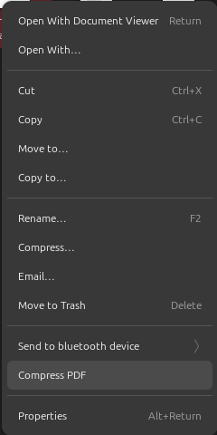
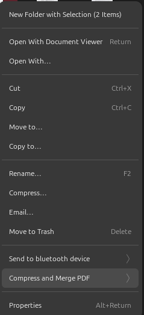

# Nautilus PDF Compress

This extension adds a context menu item to nautilus that allows you to compress and marge PDF

Install on other distros
Make sure python3, nautilus-python, ghostscript

then download, extract the zip file and copy the CompressPDF.py file to

/usr/share/nautilus-python/extensions/

or

~/.local/share/nautilus-python/extensions/

then restart nautilus using nautilus -q command

